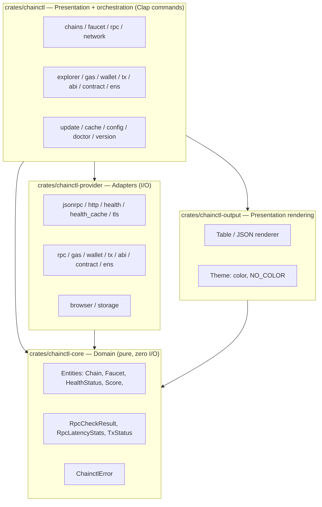
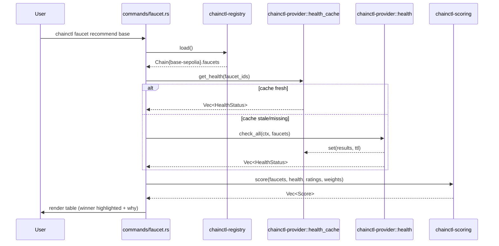
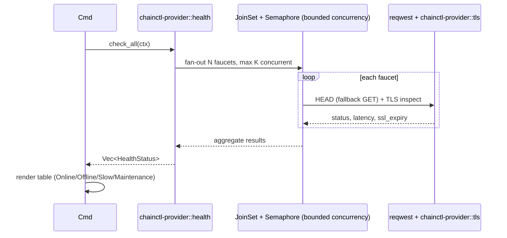

# ChainCTL — Architecture & Design Document

**Status:** v6 — all 5 phases shipped (build/tests/clippy clean, every module verified against real live endpoints). ChainCTL is now the full blockchain developer toolkit described in the original goal, not just the faucet module. Telemetry is the one documented item intentionally not built — everything else in the original command tree is implemented and working.
**Scope:** Module 1 (Testnet Faucet Discovery & Management) plus the platform architecture that lets future modules (`rpc`, `gas`, `explorer`, `wallet`, `abi`, `contract`, `tx`, `doctor`, `network`, `ens`) be added without refactoring.

---

## 0. Technology Decisions

### 0.1 Language: **Rust**

| Criterion | Rust | Go | TypeScript/Node |
|---|---|---|---|
| Single static binary, no runtime dep | Yes (native, no GC) | Yes (native) | No — needs Node or a bundler (pkg/bun/deno compile), heavier binaries, slower cold start |
| Cross-compilation | Needs a cross toolchain (`cross`, `cargo-zigbuild`) — more CI setup than Go, but well-trodden (Foundry, ripgrep, delta all ship this way) | Trivial (`GOOS`/`GOARCH`) | N/A (bundlers vary in cross-target reliability) |
| Concurrency for parallel faucet health checks | `tokio` async + `JoinSet`/`Semaphore` for bounded fan-out — more ceremony than goroutines but precise control over concurrency limits and cancellation, which the rate-limit-conscious health engine (§9) specifically needs | Goroutines + `errgroup` — simpler, less explicit control | `Promise.all` — fine, weaker typing, no built-in concurrency limits |
| CLI ecosystem precedent | **Foundry (`forge`/`cast`), `cargo`, `ripgrep`, `delta`, `starship`** — the dominant precedent in crypto-native tooling specifically, which is directly on-genre for a blockchain developer CLI | kubectl, docker, gh, hugo, terraform, helm | npm CLIs common, rarely in the git/docker "systems tool" category |
| Runtime safety | No GC pauses, no null-pointer/nil-interface class of bugs, exhaustive `enum` matching (e.g. `HealthStatus` variants can't silently be missed in a `match`) — a real advantage once the command tree and provider surface grow across Phases 2–5 | GC, `nil` interfaces are a common footgun | GC, weak typing without discipline |
| Contributor pool for an open-source infra CLI | Smaller than Go's, but the *blockchain developer* audience specifically already knows Rust from Foundry/Solana — the target user base overlaps with the contributor base | Larger general pool | Largest pool, but skews web/app, not systems CLI |
| Compile speed / iteration loop | Slower than Go, especially clean builds — mitigated with `sccache`/incremental builds and a lean dependency graph | Fast | N/A |

**Decision: Rust.** This is the deliberate choice for this project: the target audience — blockchain developers — already lives in Rust via Foundry (`forge`/`cast`), and matching that ecosystem's conventions (Clap-based CLIs, `cargo`-style tooling) makes ChainCTL feel native to the people it's for, not just structurally similar to `kubectl`. Rust's ownership model and exhaustive enum matching also pay off specifically in the health/scoring engines (§9–10), where silently mishandling one `HealthStatus` variant or one malformed registry entry has real UX consequences. The tradeoffs — slower clean-build times, a steeper contribution curve, more explicit cross-compilation setup — are accepted consciously; they're mitigated by keeping the workspace's crate graph lean and CI incremental-build-cached.

### 0.2 CLI Framework: **Clap (derive API)**

- **Clap** is what Foundry's `forge`/`cast`, `ripgrep`, `cargo` itself, and most serious Rust CLIs are built on. The derive API (`#[derive(Parser)]`, `#[derive(Subcommand)]`) gives a declarative command tree that maps directly to §8's structure, with auto-generated `--help`, shell completions (via `clap_complete` — bash/zsh/fish/powershell), and a doc-generation path (`clap_mangen` / a small custom generator) for `docs/commands/*.md`.
- **Layered configuration** ended up as a hand-rolled dot-path get/set over `serde_yaml::Value` in `chainctl/src/commands/config.rs`, not the `figment` crate originally floated here — the actual precedence need turned out narrower than Viper's full model (typed getters like `get_weights`/`get_health_settings`/`get_ens_rpc_url` each just read one `config.yaml` key with a hardcoded default fallback; there's no env-var layer yet). Pulling in `figment` for that would have been the abstraction the code didn't need — a good example of §0's "don't design for hypothetical requirements" cutting the other way from the original plan.
- Alternatives considered: `argh` (too minimal for a nested command tree this size), hand-rolled parsing (no). Clap wins on precedent alone — contributors coming from Foundry will already know the conventions, and it's the closest Rust analogue to what Cobra is in Go.

### 0.3 License: **MIT** (recommend), Apache-2.0 as fallback if patent-grant language becomes a concern later. MIT minimizes adoption friction for a developer-tooling CLI; most peer tools (`gh`, `hugo`) are MIT.

---

## 1. Architecture Overview

Clean Architecture, adapted for a Rust CLI as a **Cargo workspace of crates** (not a web service — no controllers, but the same dependency direction rules apply: **dependencies point inward, toward the domain**). Each architectural layer is its own workspace crate; the crate graph itself enforces the dependency direction (a crate that isn't declared as a path-dependency literally cannot be imported), which is a stronger guarantee than Go's `internal/` convention.



**Rule:** `chainctl-core` depends on nothing else in the workspace (only `serde`/`chrono`/`thiserror`). `chainctl-provider` depends on `chainctl-core` for the shared types/errors it returns, plus whatever I/O crates a given module needs (`reqwest`, `native-tls`, `sha3`, ...) — it never depends on `chainctl-output` or the `chainctl` bin crate. `chainctl-output` depends on `chainctl-core` for the types it renders, never on `chainctl-provider`. `chainctl` (the bin crate) is the only crate allowed to depend on all of them, and is where they get wired together per command. This is what made the "add `chainctl rpc`/`gas`/`wallet`/`tx`/`abi`/`contract`/`ens` without refactoring" claim hold in practice across Phases 4–5: each one added a new `chainctl-core::domain` type (where needed), a new `chainctl-provider` module, and a new `commands/` file — never touched the faucet module's internals — and the workspace's `Cargo.toml` dependency graph makes an accidental layering violation (e.g. `chainctl-output` reaching into `chainctl-provider`) a compile error, not just a convention someone can forget.

---

## 2. Folder Structure

A Cargo **workspace** — each layer is its own crate, matching §1's dependency-direction rule at the tooling level, not just by convention.

This is the structure as actually shipped (Phases 1–5). One deliberate deviation from the original plan: **there is no separate `chainctl-service` crate.** That looked necessary for by-the-book clean-architecture layering early on, but in practice the per-command orchestration (load registry → resolve chain → call provider → render) is thin enough that folding it directly into each `chainctl/src/commands/*.rs` file — rather than a fourth indirection layer — kept the code easier to follow, without weakening the boundary that actually matters: `chainctl-core` still has zero I/O, and `chainctl-provider` still owns every network/filesystem call in the project.

```
chainctl/
├── Cargo.toml                        # workspace manifest: members, shared deps, profile
│
├── crates/
│   ├── chainctl/                     # bin crate — the actual `chainctl` executable
│   │   ├── Cargo.toml
│   │   └── src/
│   │       ├── main.rs               # entrypoint: #[tokio::main], plugin-convention fallback, error → exit code
│   │       └── commands/
│   │           ├── mod.rs            # root Clap `Parser`, global args, `Context` (DI), subcommand dispatch
│   │           ├── chains.rs         # chains [info]
│   │           ├── faucet.rs         # faucet search|info|open|status|recommend (+ live-health caching, --watch)
│   │           ├── rpc.rs            # rpc list|test|latency
│   │           ├── network.rs        # network add|list|remove (registry.override.json)
│   │           ├── explorer.rs       # explorer open|tx|address
│   │           ├── gas.rs            # gas price|estimate
│   │           ├── wallet.rs         # wallet balance
│   │           ├── tx.rs             # tx status
│   │           ├── abi.rs            # abi encode|decode
│   │           ├── contract.rs       # contract read
│   │           ├── ens.rs            # ens resolve|reverse
│   │           ├── update.rs         # update
│   │           ├── cache.rs          # cache clear|info|refresh
│   │           ├── config.rs         # config get|set|list|edit (+ typed getters every other command reads)
│   │           ├── doctor.rs         # doctor
│   │           └── version.rs        # version
│   │
│   ├── chainctl-core/                # domain layer — depends on nothing but serde/chrono/thiserror
│   │   └── src/
│   │       ├── domain.rs             # Chain, Faucet, HealthStatus, Score, RpcCheckResult, RpcLatencyStats, TxStatus
│   │       └── error.rs              # ChainctlError enum (thiserror) + exit-code mapping + remediation hints
│   │
│   ├── chainctl-provider/            # adapters (I/O) — every network/filesystem call in the whole project
│   │   └── src/
│   │       ├── jsonrpc.rs            # generic JSON-RPC call() — the one function rpc/gas/wallet/tx/ens all use
│   │       ├── http.rs               # plain HTTP fetch (registry `update`), shared UA string
│   │       ├── health.rs             # concurrent bounded faucet health checks (JoinSet + Semaphore + per-host throttle)
│   │       ├── health_cache.rs       # TTL read-through cache for health results
│   │       ├── tls.rs                # TLS certificate-expiry inspection (native-tls + x509-parser)
│   │       ├── rpc.rs                # eth_chainId-based endpoint check/benchmark
│   │       ├── gas.rs                # eth_gasPrice / eth_estimateGas
│   │       ├── wallet.rs             # eth_getBalance
│   │       ├── tx.rs                 # eth_getTransactionByHash + eth_getTransactionReceipt
│   │       ├── abi.rs                # hand-rolled ABI encode/decode, keccak256, EIP-55 checksum
│   │       ├── contract.rs           # encode call → eth_call → decode result
│   │       ├── ens.rs                # namehash + registry/resolver eth_call resolution (mainnet)
│   │       ├── browser.rs            # cross-platform "open URL" (the `open` crate)
│   │       └── storage.rs            # atomic file writes, XDG-aware `~/.chainctl` path resolution
│   │
│   ├── chainctl-output/              # presentation rendering — never called from chainctl-provider
│   │   └── src/
│   │       ├── table.rs              # comfy-table rendering for every command
│   │       ├── json.rs               # machine-readable `--output json`
│   │       └── theme.rs              # color/icon/`NO_COLOR`-aware theming
│   │
│   ├── chainctl-registry/            # PUBLIC crate — registry loading, embedded snapshot, override merging
│   │   └── src/lib.rs
│   │
│   └── chainctl-scoring/             # PUBLIC crate — standalone weighted-scoring algorithm, zero I/O
│       └── src/lib.rs
│
├── configs/
│   ├── config.default.yaml           # embedded via `include_str!` — default config template
│   └── registry.snapshot.json        # embedded fallback registry so the binary works offline on first run
│
├── LICENSE
├── CONTRIBUTING.md
├── SECURITY.md
├── CODE_OF_CONDUCT.md
└── README.md
```

*(`.github/` workflows, issue templates, and other GitHub-side repo scaffolding are being handled separately and are intentionally not detailed here — this document covers the Rust project itself.)*

**Why separate crates instead of one crate with modules:** `chainctl-registry` and `chainctl-scoring` are the deliberate public surface — e.g., someone building a dashboard or a Discord bot on top of the same faucet data can depend on just those two crates (`cargo add chainctl-registry chainctl-scoring`) without pulling in Clap, `reqwest`, or any CLI-only code. `chainctl-core`/`chainctl-provider`/`chainctl-output`/`chainctl` stay internal (`publish = false` in their manifests) — Cargo's workspace-member boundary plays the role Go's `internal/` compiler check would have played, but it's enforced by the dependency graph itself rather than a path convention.

---

## 3 & 4. Module Design and Package Responsibilities

### `chainctl-core::domain`
Pure data + validation, zero imports outside `serde` + stdlib.
- `struct Chain { id, name, chain_id, symbol, network, parent_chain, explorer_url, rpc_urls, aliases }`
- `struct Faucet { id, name, url, source, provider, requirements, cooldown, amount_per_claim, priority, tags, health_check, metadata }`
- `struct HealthStatus { faucet_id, checked_at, status: HealthState, http_status, latency_ms, ssl_valid, ssl_expires_at, error }` where `enum HealthState { Online, Offline, Degraded, Maintenance, Unknown }` — Rust's exhaustive `match` means a new variant forces every call site (rendering, scoring) to handle it, rather than silently falling through a default case.
- `struct Score { faucet_id, total, breakdown: HashMap<String, f64> }`

### `chainctl-core::error`
`ChainctlError` is the one thing every layer shares — see §11. There's no separate `ports` trait layer with `Arc<dyn Trait>` dependency injection as originally sketched here: with only one real implementation of each capability (one HTTP client, one filesystem), the trait indirection had no second implementation to justify it, so `chainctl-provider`'s functions are called directly. The boundary that matters — `chainctl-core` has zero I/O — holds either way; this is a "don't add abstraction the code doesn't need yet" call, not a layering violation.

### How a command actually executes
Every `chainctl/src/commands/*.rs` file follows the same shape: `Context` (built once in `main.rs` — resolved `~/.chainctl` paths, output format, theme, `--fresh`/`--quiet` flags) is passed in; the command loads the registry via `ctx.load_registry()`, resolves a chain via `ctx.resolve_chain()`, calls straight into the relevant `chainctl-provider` function(s), and renders the result via a `chainctl-output::render_*` call. `chainctl/src/commands/config.rs` is the one command module every *other* command module also calls into directly (`super::config::get_weights`, `get_health_settings`, `get_ens_rpc_url`, etc.) — it's the layered-config reader every typed setting flows through, matching the "config precedence" role §0.2 originally assigned to Viper/figment.

### `chainctl-provider::*`
Owns every network and filesystem call in the project (full file list in §2). Two things hold it together:
- **`jsonrpc::call(url, method, params, timeout)`** is the one function `rpc`, `gas`, `wallet`, `tx`, `contract`, and `ens` all build on — a new EVM-read module is, almost always, just a new small file that calls this and shapes the result.
- **`health.rs`**'s concurrent pattern (`tokio::task::JoinSet` + `Semaphore` + per-host throttle, §9) is the template `rpc.rs` reused for endpoint checking (deliberately *without* the per-host throttle — RPC nodes are built for frequent traffic, faucets aren't).

### `chainctl-output::*`
Rendering only — never called from `chainctl-provider`. Supports `--output table|json|plain`, `--no-color` / `NO_COLOR`-aware theming, and camelCase JSON field names matching the registry schema's convention throughout (including the presentation-layer row types like `HealthRow`/`RpcListRow`, via `#[serde(rename_all = "camelCase")]`).

---

## 5. Sequence Diagrams

### `chainctl faucet recommend base`


### `chainctl faucet status`


---

## 6. JSON Schemas

### 6.1 Faucet Registry (`registry.json`) — the core data model

```json
{
  "$schema": "https://chainctl.dev/schemas/registry-v1.json",
  "version": "1.0.0",
  "updatedAt": "2026-07-28T00:00:00Z",
  "chains": [
    {
      "id": "base-sepolia",
      "name": "Base Sepolia",
      "chainId": 84532,
      "symbol": "ETH",
      "network": "testnet",
      "parentChain": "ethereum",
      "explorerUrl": "https://sepolia.basescan.org",
      "rpcUrls": ["https://sepolia.base.org"],
      "aliases": ["base", "base-testnet"],
      "faucets": [
        {
          "id": "base-official",
          "name": "Base Official Faucet",
          "url": "https://portal.cdp.coinbase.com/products/faucet",
          "source": "official",
          "provider": "Coinbase",
          "requirements": {
            "githubAuth": true,
            "discordAuth": false,
            "captcha": true,
            "walletConnect": false,
            "minMainnetBalance": { "chain": "ethereum", "amount": "0.001", "symbol": "ETH" }
          },
          "cooldown": { "amount": 24, "unit": "hours" },
          "dailyLimit": null,
          "amountPerClaim": { "amount": "0.05", "symbol": "ETH" },
          "priority": 1,
          "excludeFromHealthCheck": false,
          "tags": ["official", "fast"],
          "healthCheck": {
            "method": "HEAD",
            "endpoint": "https://portal.cdp.coinbase.com/products/faucet",
            "expectedStatus": [200, 301, 302]
          },
          "metadata": {
            "addedAt": "2026-01-10T00:00:00Z",
            "lastVerifiedAt": "2026-07-20T00:00:00Z",
            "maintainer": "chainctl-core"
          }
        }
      ]
    }
  ]
}
```

**Extensibility rules:**
- `version` is semver for the *schema itself*; `chainctl update` runs a migration function keyed on this field, so old caches don't break on a schema bump.
- `source` is an open enum (`official | partner | community`) — new values are additive, not breaking.
- `metadata` and `requirements` are intentionally loose objects (`additionalProperties: true` in the JSON Schema) so new fields (e.g., a future `zkProofRequired`) don't require a schema-version bump.
- `excludeFromHealthCheck` lets a faucet operator (via PR) opt out of automated probing — see §9 abuse-prevention.

### 6.2 Health cache record (`~/.chainctl/cache/health.json`)
```json
{
  "faucetId": "base-official",
  "checkedAt": "2026-07-28T10:15:00Z",
  "status": "online",
  "httpStatus": 200,
  "latencyMs": 320,
  "sslValid": true,
  "sslExpiresAt": "2026-11-01T00:00:00Z",
  "redirected": false,
  "error": null
}
```

### 6.3 Config (`~/.chainctl/config.yaml`)
```yaml
version: 1
output:
  format: table       # table | json | plain
  color: auto          # auto | always | never
  icons: true
registry:
  source: https://raw.githubusercontent.com/chainctl/registry/main/registry.json
  updateIntervalHours: 24
cache:
  dir: ~/.chainctl/cache
  ttlMinutes: 30
health:
  concurrency: 5
  timeoutSeconds: 5
  userAgent: "chainctl/1.0 (+https://github.com/akshat3106/ChainCTL-blockchain-developer-toolkit-CLI)"
recommend:
  weights:
    official: 0.40
    availability: 0.30
    latency: 0.15
    community: 0.10
    recentFailures: 0.05
telemetry:
  enabled: false        # opt-in only, disclosed in README/SECURITY
```

Actual JSON Schema files (draft-07) for CI validation live at `docs/schemas/registry.schema.json`, `config.schema.json`, `health-cache.schema.json` — to be generated in Phase 1 implementation.

---

## 7. Configuration & Caching

```
~/.chainctl/
├── config.yaml
├── registry.json          # last-known-good registry (post `update`)
├── registry.override.json # optional user-defined faucets, merged on load
├── cache/
│   ├── health.json         # health-check results, TTL-governed
│   └── last-update.json    # timestamp + checksum of last successful `update`
└── logs/
    └── chainctl.log
```

- **Path resolution:** the `directories` crate's `ProjectDirs` gives correct per-OS conventions (`$XDG_CONFIG_HOME` on Linux, `%APPDATA%` on Windows, `~/Library/Application Support` on macOS) collapsed to a single `~/.chainctl`-style base, overridable via `$CHAINCTL_HOME` and `--config-dir`.
- **Offline mode:** every command that needs the registry first tries `~/.chainctl/registry.json`; if absent, falls back to `configs/registry.snapshot.json`, embedded into the binary at compile time via `include_str!` — **the tool works with zero network access on first run.**
- **Cache expiration:** each cache entry carries its own TTL (health: minutes; registry: hours-to-days). Reads past TTL trigger a background-refresh-then-serve-stale-once pattern (like HTTP `stale-while-revalidate`) so commands never block on a slow network unless `--fresh` is passed.
- **Registry updates:** `chainctl update` fetches, verifies checksum, schema-validates, atomically swaps `registry.json`, and only then invalidates dependent caches.

---

## 8. Command Tree

This is the actual shipped command surface:

```
chainctl
├── chains
│   ├── (default → list)
│   └── info <chain>
├── faucet
│   ├── search <chain> [--source official|partner|community]
│   ├── info <chain> [--faucet <id>]
│   ├── open <chain> [--faucet <id>]
│   ├── status [chain] [--watch] [--interval <secs>]
│   └── recommend <chain> [--explain]
├── rpc
│   ├── list [chain]
│   ├── test [chain]
│   └── latency <chain> [--samples <n>]
├── network                                   # custom chains, layered on the base registry
│   ├── add <id> --name .. --chain-id .. --symbol .. --rpc-url ..
│   ├── list
│   └── remove <id>
├── explorer
│   ├── open <chain>
│   ├── tx <chain> <hash>
│   └── address <chain> <address>
├── gas
│   ├── price <chain>
│   └── estimate <chain> [--to] [--from] [--value] [--data]
├── wallet
│   └── balance <chain> <address>             # read-only — no key generation, no signing
├── tx
│   └── status <chain> <hash>
├── abi
│   ├── encode "<signature>" <args...>        # cast-style: "transfer(address,uint256)"
│   └── decode "<signature>" <calldata>
├── contract
│   └── read <chain> <address> "<sig>(<in>)(<out>)" <args...>
├── ens
│   ├── resolve <name>                        # mainnet-only, independent of the testnet registry
│   └── reverse <address>
├── update
├── cache
│   ├── clear
│   ├── info
│   └── refresh
├── config
│   ├── get <key>
│   ├── set <key> <value>
│   ├── list
│   └── edit
├── doctor
├── version
└── chainctl-<name>                           # unrecognized subcommands fall through to a
                                                # same-named binary on $PATH (git/kubectl-style)
```

**Global flags** (Clap global args on the root `Parser`): `--output/-o table|json|plain`, `--no-color`, `--config-dir <path>`, `--quiet/-q`, `--fresh` (bypass cache).

---

## 9. Health Engine — Checking Without Abusing Faucet Servers

1. **Prefer `HEAD` over `GET`**; fall back to `GET` only if a server rejects `HEAD` (some do — record this per-faucet in `healthCheck.method`).
2. **Cache aggressively.** Default TTL 30 min; repeated `chainctl faucet status` calls within the window serve cached results, no new requests.
3. **Bounded, jittered concurrency.** Global worker pool cap (default 5, configurable) with randomized inter-request delay (50–300ms jitter) — no thundering herd against any single host.
4. **Per-host rate ceiling.** Independent of global concurrency, cap requests per host (e.g., 1 per 5 minutes) regardless of how many faucets on that domain are being checked, tracked via `cacherepo`.
5. **Identify honestly.** Custom `User-Agent: chainctl/<version> (+https://github.com/akshat3106/ChainCTL-blockchain-developer-toolkit-CLI)` (derived at compile time from `CARGO_PKG_REPOSITORY`, so it tracks the manifest) so operators can identify and, if needed, block or contact the project — never spoof a browser UA.
6. **Opt-out respected.** `excludeFromHealthCheck: true` in the registry entry (settable via PR by the faucet operator) skips active probing entirely; status shows `unknown (opt-out)`.
7. **No claim-flow automation in the health engine** — it only checks reachability/latency/TLS of the published URL, never submits forms or attempts a claim. Automating claims is explicitly out of scope.
8. **Background/scheduled checking is opt-in only** (`chainctl faucet status --watch`, or a user-installed cron); ChainCTL does not silently run a background daemon.

---

## 10. Recommendation Algorithm

Weighted scoring, 0–100 scale, weights configurable in `config.yaml` (§6.3 defaults shown):

| Factor | Default weight | Basis |
|---|---|---|
| Official priority | 40% | `source == official` → 100; `partner` → 60; `community` → 30, scaled by `priority` field |
| Availability | 30% | Rolling uptime % over last N checks (from cache history, decayed) |
| Latency | 15% | Normalized against the fastest faucet for that chain (`100 * fastest/this`, capped) |
| Community rating | 10% | Optional future crowdsourced rating (Phase 2+); defaults to neutral 50 if absent |
| Recent failures | 5% (penalty) | Exponential-decay penalty: each failure in the last 24h subtracts, decaying to zero influence after ~7 days |

```
score = 0.40*official + 0.30*availability + 0.15*latency + 0.10*community − 0.05*recentFailurePenalty
```

Implemented in `chainctl-scoring` as a pure function `fn score(faucets: &[Faucet], health: &[HealthStatus], ratings: &[Rating], weights: &Weights) -> Vec<Score>`, independently unit-testable with synthetic inputs (no network, no async, no I/O in this crate at all). `chainctl faucet recommend <chain> --explain` prints the per-factor breakdown, not just the winner — matching the "developer tool, not a black box" goal.

---

## 11. Error Handling

`chainctl-core::errors` defines a typed error enum (via `thiserror`), each variant mapped to an exit code and a remediation hint rendered by `chainctl-output`:

```rust
#[derive(thiserror::Error, Debug)]
pub enum ChainctlError {
    #[error("Unknown chain '{0}'")]
    ChainNotFound(String),
    #[error("No network connection and no cached registry")]
    Offline,
    #[error("Local registry failed validation")]
    RegistryCorrupted,
    #[error("Request to {0} timed out after {1}s")]
    Timeout(String, u64),
    #[error("Too many checks too fast")]
    RateLimited,
}
```

| Error | Exit code | User-facing hint |
|---|---|---|
| `ChainNotFound` | 4 | "Unknown chain 'xyz'. Run `chainctl chains` to see supported chains." |
| `Offline` | 3 | "No network connection and no cached registry. Connect and run `chainctl update`." |
| `RegistryCorrupted` | 4 | "Local registry failed validation. Run `chainctl update --force` to re-fetch." |
| Cache expired | 0 (warning, not fatal) | Silently refreshes in background unless `--fresh` |
| `Timeout` | 3 | "Request to <faucet> timed out after 5s. It may be down — check `chainctl faucet status`." |
| `RateLimited` | 3 | "Too many checks too fast — try again in a moment." |

`main.rs` catches the top-level `Result<(), ChainctlError>` from command dispatch, maps the variant to an exit code via `std::process::exit`, and renders through `chainctl-output` rather than a raw `Debug` print. Rendered style (kubectl/gh-like): `✗ <message>` in red, followed by a dimmed `→ <hint>` line. `--output json` mode emits `{"error": {"code": "...", "message": "...", "hint": "..."}}` instead, for scripting.

---

## 12. Testing Strategy

- **Unit tests** (`#[cfg(test)]` modules, table-driven via `rstest` where useful) — `chainctl-core`, `chainctl-scoring` fully covered with zero I/O.
- **Provider tests** — `wiremock` (or `mockito`) mock servers for `chainctl-provider::http` and `::github`; verify retry/backoff, TLS-expiry parsing, checksum rejection on tampered payloads.
- **Golden-file / snapshot tests** — `chainctl-output` table/JSON rendering snapshot-tested via `insta`, so UX regressions are caught in CI.
- **Integration tests** (`tests/` per crate, `#[tokio::test]`) — spin up local mock faucet servers (`wiremock`) representing online/offline/slow/maintenance, run real `health`/`recommend` services against them.
- **CLI end-to-end tests** — `assert_cmd` + `predicates` drive the actual built binary, assert stdout/exit codes — catches Clap wiring bugs unit tests can't.
- **Schema tests** — CI validates `registry.json` (and any PR-modified version) against `docs/schemas/registry.schema.json` (via `jsonschema` crate or a CI-side validator); fuzz-test the JSON parser (`cargo-fuzz`) for malformed-input robustness.

---

## 13. Repository Hygiene & CI

Open-source scaffolding (`LICENSE`, `CONTRIBUTING.md`, `SECURITY.md`, `CODE_OF_CONDUCT.md`, `.github/` workflows, issue templates, release automation) is being set up separately and is intentionally out of scope for this document. For reference, the Rust-native equivalents of the tooling described earlier for a Go project would be: `clippy` + `rustfmt --check` for lint, `cargo test --workspace` matrix across OSes for CI, and `cargo-dist` (or `cross` + manual packaging) in place of `goreleaser` for cross-platform release builds, checksums, and Homebrew/Scoop publishing.
